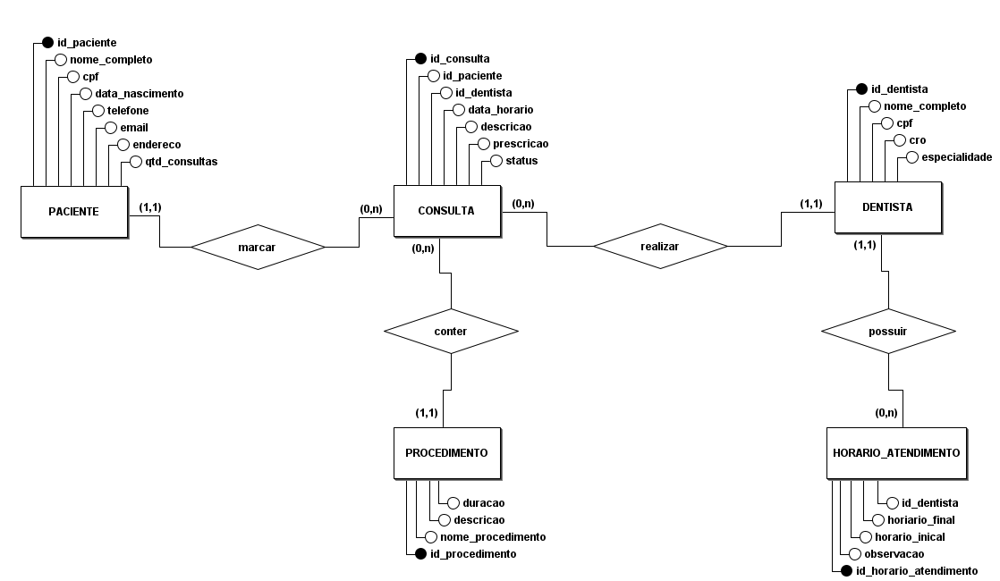
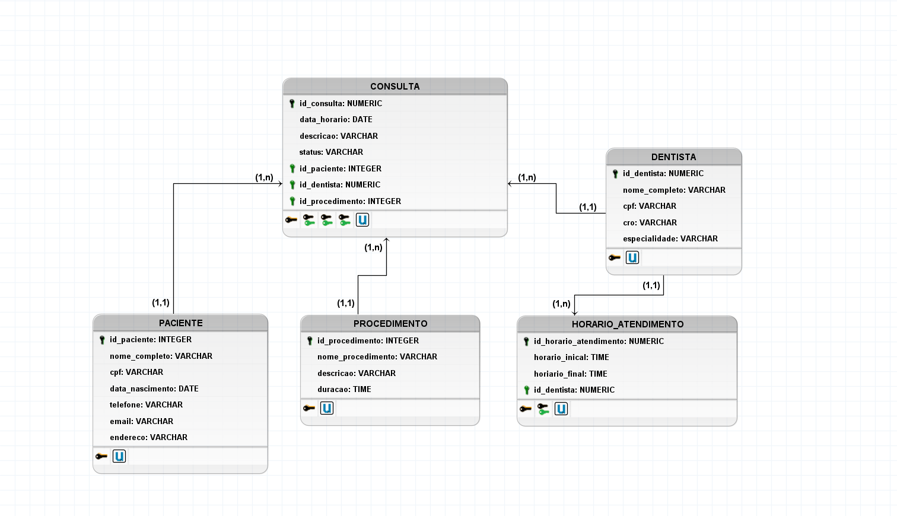

# 🦷 Trabalho de Estudo - Sistema de Gestão para Clínica Odontológica

## 📖 Sobre o Projeto

Este projeto consiste no desenvolvimento de uma base de dado para uma clínica odontológica, com o objetivo de informatizar o controle de pacientes, dentistas, consultas e procedimentos realizados.
A solução foi pensada para atender o fluxo operacional da clínica, permitindo o agendamento de consultas, registro de atendimentos e organização das informações de forma estruturada com base no desafio infomado.

> ⚠️ O sistema não contempla funcionalidades financeiras ou de faturamento.

## 🎯 Objetivos

- Organizar o cadastro de pacientes e dentistas
- Controlar o agendamento de consultas
- Registrar atendimentos realizados
- Estruturar um banco de dados completo (conceitual, lógico e físico)
- Aplicar consultas SQL para análise de dados

---

# ⚙️ Funcionalidades

### 👤 Pacientes

- **Cadastro completo**:
  - Nome, CPF, data de nascimento
  - Contato _(telefone e e-mail)_
  - Endereço
- **Histórico de consultas vinculado**

### 🧑‍⚕️ Dentistas

- **Cadastro com:**
  - Nome, CPF e CRO
  - Especialidade
  - Horários de atendimento

### 📅 Consultas

- **Agendamento com**:
  - Escolha de dentista
  - Seleção de horário disponível

- **Registro de**:
  - Data e hora
  - Descrição do atendimento
  - Prescrição _(quando necessário)_

- **Funcionalidades**:
  - Atualização de consultas
  - Cancelamento com regras de prazo

### 🦷 Procedimentos

- **Cadastro contendo:**
  - Nome
  - Descrição
  - Duração média
- Associação com consultas _(1 ou mais procedimentos por consulta)_

### 🧾 Acesso ao Sistema

- Atendentes podem:
  - Visualizar dados
  - Atualizar pacientes, dentistas e consultas

### 🏗️ Modelagem do Banco

O projeto contempla as três etapas de modelagem:

- 📌 [Modelo Conceitual](./Modelo/Conceitual/Modelo_conceitual.png)
- 📌 [Modelo Lógico](./Modelo/Logico/Modelo_logico.png)
- 📌 [Modelo Físico](./Scripts/07%20-%20script%20Completo/script_completo_grupo_01.sql)

### 📷 Imagens dos modelos:

<div>
<p>
<a href="./Modelo/Conceitual/Modelo_conceitual.brM3">Modelo Conceitual</a>
</p>

</div>
<br/>
<br/>
<br/>
<div>
<p>
<a href="./Modelo/Logico/Modelo_logico.brM3">Modelo Logico</a>
</p>

</div>

### 🗄️ Estrutura do Banco de Dados

- Mínimo de 10 registros por tabela
  - [Valores inseridos](./Scripts/02%20-%20Inserção%20de%20Valores/valores.md)
- Dados inseridos via comandos [**INSERT**](./Scripts/02%20-%20Inserção%20de%20Valores/script_insert_into.sql)

# 🚀 Scripts SQL

> O projeto inclui um único script contendo:

- 📌 **Índices**
  - Criação de 2 índices para otimização

- ✏️ **Atualizações**
  - 3 comandos UPDATE com condições

- ❌ **Exclusões**
  - 3 comandos DELETE com condições

- 🔍 **Consultas SQL / 📊 Consultas Analíticas**
  - Quantidade de consultas por especialidade
  - Quantidade de consultas por dentista
  - Ordenado de forma decrescente
  - Pacientes com maior número de consultas
  - Média de consultas por dentista

- 👁️ **View Criada** -
  Lista de consultas ordenadas por data, contendo:
  - ID da consulta
  - Nome do paciente
  - Nome do dentista
  - Data da consulta
  - Procedimentos realizados

## 📁 Organização do Projeto

```
├── 📁 IMG_EXEMPLO
├── 📁 Modelo
│   ├── 📁 Conceitual
│   │   ├── 📄 Modelo_conceitual.brM3
│   │   └── 🖼️ Modelo_conceitual.png
│   └── 📁 Logico
│       ├── 📄 Modelo_logico.brM3
│       └── 🖼️ Modelo_logico.png
├── 📁 Scripts
│   ├── 📁 01 - Criação de Tabelas
│   │   ├── 📁 backup
│   │   │   ├── 📄 backup_1.sql
│   │   │   └── 📄 backup_2.sql
│   │   └── 📄 script_create_table.sql
│   ├── 📁 02 - Inserção de Valores
│   │   ├── 📄 script_insert_into.sql
│   │   └── 📝 valores.md
│   ├── 📁 03 - Criação dos Indexs
│   │   └── 📄 script_index.sql
│   ├── 📁 04 - Atualização de Dados
│   │   └── 📄 script_update.sql
│   ├── 📁 05 - Exclusão de registros com condições em alguma tabela
│   │   └── 📄 script_delete.sql
│   ├── 📁 06 - Consultas contextualizadas
│   │   └── 📄 script_select.sql
│   └── 📁 07 - script Completo
│       └── 📄 script_completo_grupo_01.sql
└── 📝 README.md
```

## 💻 Tecnologias Utilizadas

- SQL (PostgreSQL ou similar)
- Modelagem de Banco de Dados

## 📌 Como Executar

- **Clone o repositório:**
  - ```bash
    git clone https://github.com/Phonedison/banco_dados_grupo_01.git
    ```
- **Execute o script SQL no seu banco:**
  - Execute o arquivo `script_completo_grupo_01.sql` completo

### 📎 Observações

- Projeto com foco em prática de modelagem e SQL
- Estrutura preparada para fácil expansão futura (ex: módulo financeiro)

## 👥 Colaboradores

<div align="Center" >
<a href="https://github.com/devAnaLuX">

</a>
<a href="https://github.com/x-c-x-c">

</a>
<a href="https://github.com/Phonedison">

</a>
<a href="https://github.com/albino57">

</a>
<a href="https://github.com/vLamass">

</a>
<a href="https://github.com/vitorribeiro77">

</a>
</div>
